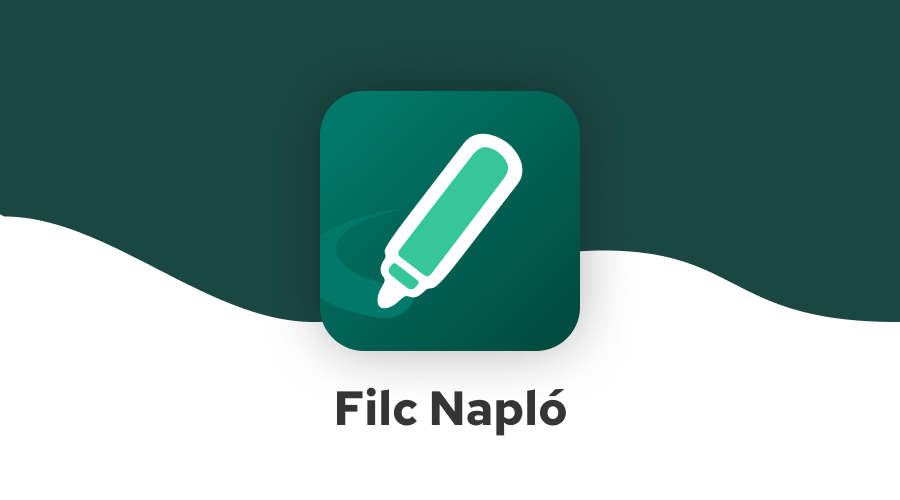

A népszerű Filc alkalmazás, alapoktól újraírva. Az eddiginél is gyorsabb és könnyebben kezelhetőbb.

### Miért írtátok újra?

Két oka is van. Az egyik az, hogy hogy a régi Filc a Szivacs kódjára épült, amit mi csak foltozgattunk, így egyre átláthatatlanabbá vált a kódbázis. A másik a Kréta új alkalmazása, ami már viszonylag gyors és könnyebben kezelhető. Mivel versenyben szeretnénk maradni, a Filcet egy teljes körű iskolai asszisztenssé szeretnénk tenni, ami segít az időd beosztásában és mindenben IS.

### Hogy tudom letölteni?

[Google playen](https://play.google.com/store/apps/details?id=hu.filcnaplo.ellenorzo) fent vagyunk, így onnan egy kattintással letöltheted. Ha a Google-t minden gonosz forrásának tartod, akkor GitHub-ról apk formátumban is elérhető az app.

A Filc IOS-en is működik, azonban az AppStore-ba való kikerüléshez évente $100-t kell befizetni. Ha szeretnéd ezt a folyamatot meggyorsítani, kérjük, adományozz [patreonon](https://patreon.com/filcnaplo).

### Hol léphetek veletek kapcsolatba?

* Itt, a GitHub-on. A pontosan megfogalmazott hibajelentéseket és funkciókéréseket az [issues oldalon](https://github.com/filcnaplo/filcnaplo/issues) várjuk, ha van GitHub fiókod.
* [Discord-on](https://filcnaplo.hu/discord). Bármilyen témában (hibajelentés, funkciókérés, jaj-miért-nem-működik probléma) szívesen várunk.
* Email-ben. A filcnaplo@gmail.com email-címen is elérhetsz minket, ha sem github, sem discord fiókod nincs.

### Loptok adatot?

Nem, a saját szerverünkre semmilyen adatot nem küldünk. Részletesebben a https://filcnaplo.hu/privacy oldalon olvashatsz erről.

### Mit segíthetek?
* Először is programozással. Forkold a repót, javíts ki egy hibát, vagy valósíts meg egy új funkciót, és küldj egy pull requestet.
* Csatlakozhatsz a bétaprogramhoz, így a szokásosnál előbb kapod meg az új funkciókat. Az esetlegesen felmerülő hibákat GitHub-on vagy Discordon jelentheted.
* A Filc terjesztésével. Oszd meg az osztálytársaiddal, barátaiddal. Ezzel jót teszel nekik és nekünk is.
* Új ötletekkel. Ha eszedbe jut valami, amitől a Filc jobb lesz, ne habozz megosztani velünk Discordon.
* [Adománnyal](https://patreon.com/filcnaplo), hogy az AppSore-ba kikerüljünk. Nem jégkrémre költjük, becsszó.
